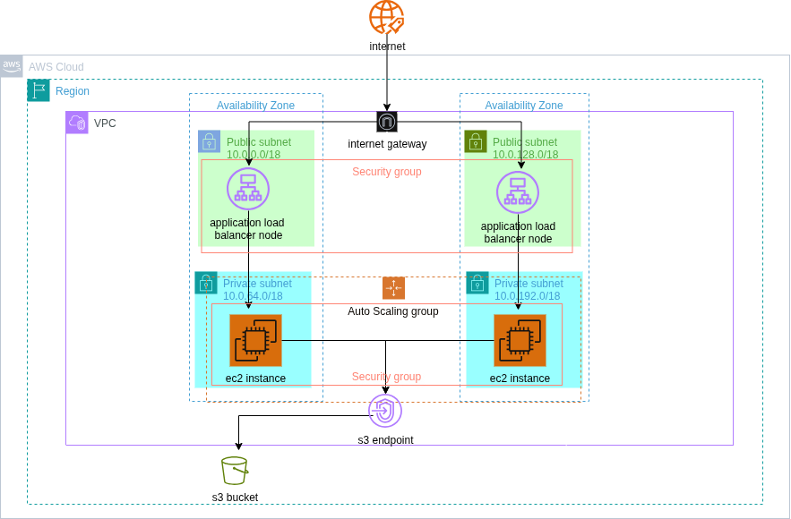

# aws-highly-available-web-app
A website hosted on 2 ec2 instances in a VPC, built for high availability with failover tested across 2 availability zones. 
This project is an opportunity for me to learn more and get some hands on practice. It is a 
highly available website hosted in two EC2 instances in the private subnets of a VPC in two AZs. The instances are
attached to an autoscaling group and an s3 endpoint for the instances to get the files for the website from an s3 bucket.
An application load balancer is placed in the public subnets to receive and route traffic into the instances and an
internet gateway to connect the VPC to the internet.

## Architecture decisions
### Instances in private subnets
The EC2 instances are in the private subnets and not the public subnets. I made this decision because I wanted the
Application Load Balancer to be the only way into the EC2 instances. This will ensure that all configurations and controls 
on the ALB (security) apply and the ALB can route traffic around a failed or unhealthy instance (availability). If the 
EC2 instances are in the public subnet, all those controls become optional.

### Security group chaining
I have two security groups in this project, the first one is the ALB security group with an inbound rule that allows HTTP 
on port 80 from IPv4 anywhere so that traffic from anywhere can get to it. The second security group is the instance 
security group with an inbound rule that only allows HTTP on port 80 from the ALB security group. I used the ALB security 
group and not the ip address because the ip address is not static and can change but the security group reference will remain 
the same regardless of what the ip address of the ALB is.

### No NAT Gateway
A NAT Gateway was considered for this project so that the EC2 instances can connect to the internet without the internet 
being able to initiate a connection with the instances. The NAT Gateway would have been used to fetch the packages needed
for patch management in the instances however, it is charged per hour and per gigabyte of data processed. I decided to save 
cost by using the Amazon Linux OS instead and configuring a VPC S3 endpoint to fetch the packages from S3 where the Amazon
Linux repos live because the gateway endpoint has no hourly or data charge.

### IMDSv2
I wrote a line in my user data that used IMDSv2 to retrieve some metadata because said metadata lives where the credentials for the 
assume role we created for the instance to be able to access S3 buckets live and we did not want accidental data leaks. The IMDSv2
protects against simple `GET` SSRF attacks by using a `PUT` to request a session token before it fetches any metadata. SSRF attacks can 
usually only trigger simple `GET` requests. It also has a Hop Limit Control. It lets you set a response hop limit (TTL) to 2, this 
limits how many network hops the response can travel and prevents other services, containerised workloads or proxies running in 
the instance from relaying the metadata response further than intended. 

### IAM role policy
I wrote an IAM role policy to allow the instances to list and get the objects in the S3 bucket that contains the static website files.
Initially, I had a wildcard allowing simple `AmazonS3ReadOnlyAccess` to my account-wide s3 buckets. I then scoped it down to allow 
`s3:GetObject` and `s3:ListBucket` from only the bucket with the website and the resources in the bucket. This is so that if an 
attacker obtains the instance credentials, the attacker can only read my public website files which are already public.

### Static Website
The goal was to demonstrate the architecture so I decided to use a static website to stand in for an application that needs server-side 
compute. A static website, however, is better served by S3 and CloudFront.

### ASG min, desired and max
For the Auto Scaling Group, the minimum was set at 2. This is because I had 2 availability zones and I wanted an instance in 
each of them to increase availability. The desired was also set at 2 because I was optimizing for availability and I wanted an 
instance up that the ALB could direct traffic to while the ASG would be provisioning a replacement instance if one instance 
failed. Max was set at 4 because I estimated at most a double increase in traffic at peak and it was also a cost decision to 
cap my spend.

### ELB health checks
I added an ELB health check to the EC2 health checks for the ASG because an EC2 health check alone would not detect if there 
was something wrong with the application on the instances. ELB health checks, however, send requests to the health check path 
and look at the response, matching the expected status code within the timeout to know if the application is running properly.

### Two AZs
The decision to have two AZs also stemmed from the decision to optimize availability. I wanted to have the application hosted 
in two different availability zones so that if one availability zone had any issues, the application would still be up in 
another availability zone. Two is also the minimum the ALB requires so I needed two availability zones in order to create the ALB.

## Problems 
### Missing S3 endpoint 
When I launched a test instance, I discovered in the system log that there was a curl timeout to the Amazon Linux repos, then 
dnf ignoring the repos and no match for nginx. The instance could not fetch the packages from S3 and that made me realize I 
did not create the S3 endpoint so I went back to do that.

### S3 endpoint on wrong route table
The system log still showed a curl timeout to the Amazon Linux repos, meaning the instance still could not fetch the 
packages. I went back to make sure there were no issues with the S3 endpoint and realized the endpoint was associated with the 
public subnet's route table. I associated it with the private subnet's route table.

### Missing instance profile
In the system log, the `aws s3 sync` in my user data failed with an `Unable to locate credentials` error. I went back to the 
launch template to check if the IAM role was in the instance profile section and it was not. I had to add it and that error was fixed.

### Incorrect destination CIDR
I could not reach the ALB from the web browser, I was getting a timeout error. I checked the ALB, ASG, the ALB security group and 
instance security group, but nothing was wrong and the instances were healthy. I then tried to reach the ALB from my phone and it 
was still the same, so I decided to try reaching it from the terminal of my laptop and the DNS resolved but the TCP connection 
timed out. I went back to check the route table which has a route pointing to the internet gateway and instead of setting `0.0.0.0/0` 
as the destination address, I had set `0.0.0.0/16`. `0.0.0.0/16` only matches the addresses starting `0.0.x.x` so the return traffic 
to any real address had no matching route and was dropped. I corrected that and I could now reach the ALB from my phone and from the browser.

## Screenshots
[Load balancer with both targets healthy](images/alb-healthy-targets.png)

[ASG instances across two availability zones](images/asg-instances-across-AZs.png)

[ALB response in us-east-1a](images/alb-response-us-east-1a.png)

[ALB response in us-east-1b](images/alb-response-us-east-1b.png)

[Target group showing instance health mid failover](images/target-group-mid-failover.png)

[ASG log showing an instance launch in response to health check fail after instance termination](images/asg-instance-replacement.png)

## Things I would do differently
- I would move off my root account and instead create an IAM user.
- I would use HTTPS with ACM.
- I would write a two statement IAM policy to pair each action with only the resource it needs.
